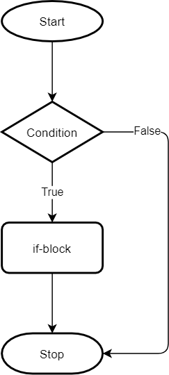
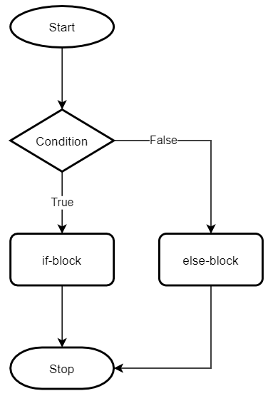
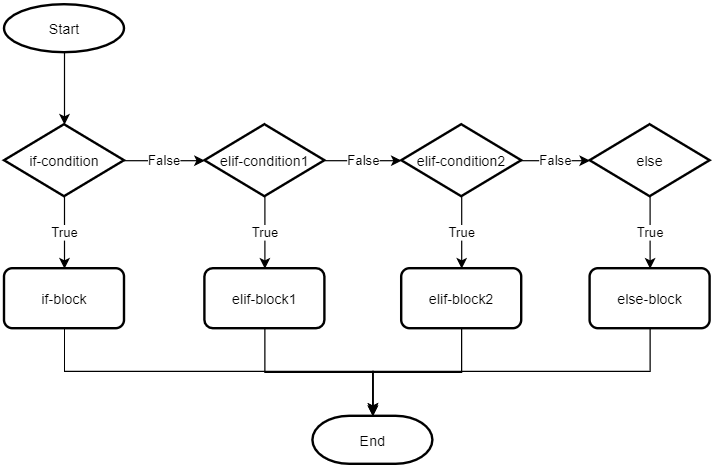

# Python `if` Statement

## The Simple Python `if` Statement
You use the `if` statement to execute a block of code based on a specified condition.

The syntax of the `if` statement is as follows:

```python
if condition:
    if-block
```

The `if` statement checks the condition first.

If the condition evaluates to `True`, it executes the statements in the `if-block`. Otherwise, it ignores the statements.

Note that the colon (`:`) that follows the condition is very important. If you forget it, you’ll get a syntax error.

The following flowchart illustrates the `if` statement:



### Example:

```python
age = input('Enter your age:')
if int(age) >= 18:
    print("You're eligible to vote.")
```

This example prompts you to input your age. If you enter a number that is greater than or equal to 18, it’ll show a message "You're eligible to vote" on the screen. Otherwise, it does nothing.

The condition `int(age) >= 18` converts the input string to an integer and compares it with 18.

```text
Enter your age: 18
You're eligible to vote.
```

### Another Example:

```python
age = input('Enter your age:')
if int(age) >= 18:
    print("You're eligible to vote.")
    print("Let's go and vote.")
```

In this example, if you enter a number that is greater than or equal to 18, you’ll see two messages.

**Indentation:**  
Indentation is very important in Python. Any statement that follows the `if` statement needs to have four spaces. If you don’t use the indentation correctly, the program will behave differently.

For example:

```python
age = input('Enter your age:')
if int(age) >= 18:
    print("You're eligible to vote.")
print("Let's go and vote.")
```

In this example, the final statement always executes regardless of the condition in the `if` statement. The reason is that it doesn’t belong to the `if` block:

```text
Enter your age: 11
Let's go and vote.
```

## Python `if...else` Statement
Typically, you want to perform an action when a condition is `True` and another action when the condition is `False`.

To do so, you use the `if...else` statement.

The following shows the syntax of the `if...else` statement:

```python
if condition:
    if-block
else:
    else-block
```

In this syntax, the `if...else` statement will execute the `if-block` if the condition evaluates to `True`. Otherwise, it’ll execute the `else-block`.

The following flowchart illustrates the `if...else` statement:



### Example:

```python
age = input('Enter your age:')
if int(age) >= 18:
    print("You're eligible to vote.")
else:
    print("You're not eligible to vote.")
```

In this example, if you enter your age as a number less than 18, you’ll see the message "You're not eligible to vote."

```text
Enter your age: 11
You're not eligible to vote.
```

## Python `if...elif...else` Statement
If you want to check multiple conditions and perform an action accordingly, you can use the `if...elif...else` statement. The `elif` stands for **else if**.

Here is the syntax of the `if...elif...else` statement:

```python
if if-condition:
    if-block
elif elif-condition1:
    elif-block1
elif elif-condition2:
    elif-block2
...
else:
    else-block
```

The `if...elif...else` statement checks each condition (`if-condition`, `elif-condition1`, `elif-condition2`, ...) in the order that they appear in the statement until it finds the one that evaluates to `True`.

When the `if...elif...else` statement finds a `True` condition, it executes the statement that follows the condition and skips testing the remaining conditions.

If no condition evaluates to `True`, the `if...elif...else` statement executes the statement in the `else` branch.

Note that the `else` block is optional. If you omit it and no condition is `True`, the statement does nothing.

The following flowchart illustrates the `if...elif...else` statement:



### Example:

```python
age = input('Enter your age:')

# convert the string to int
your_age = int(age)

# determine the ticket price
if your_age < 5:
    ticket_price = 5
elif your_age < 16:
    ticket_price = 10
else:
    ticket_price = 18

# show the ticket price
print(f"You'll pay ${ticket_price} for the ticket")
```

In this example:
- If the input age is less than 5, the ticket price will be $5.
- If the input age is greater than or equal to 5 and less than 16, the ticket price is $10.
- Otherwise, the ticket price is $18.

## Summary
- Use the `if` statement when you want to run a code block based on a condition.
- Use the `if...else` statement when you want to run another code block if the condition is not `True`.
- Use the `if...elif...else` statement when you want to check multiple conditions and run the corresponding code block that follows the condition that evaluates to `True`.
