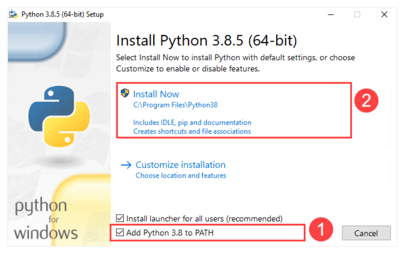
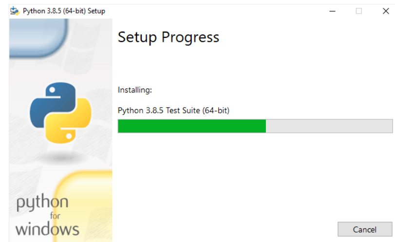
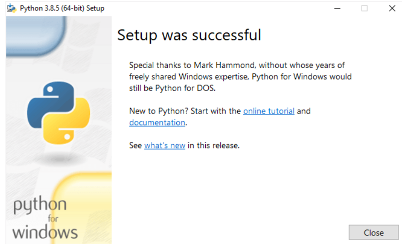
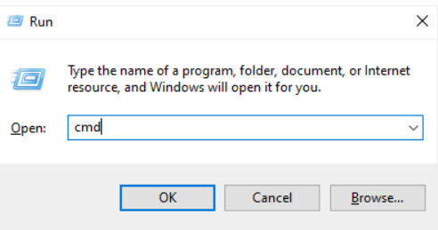
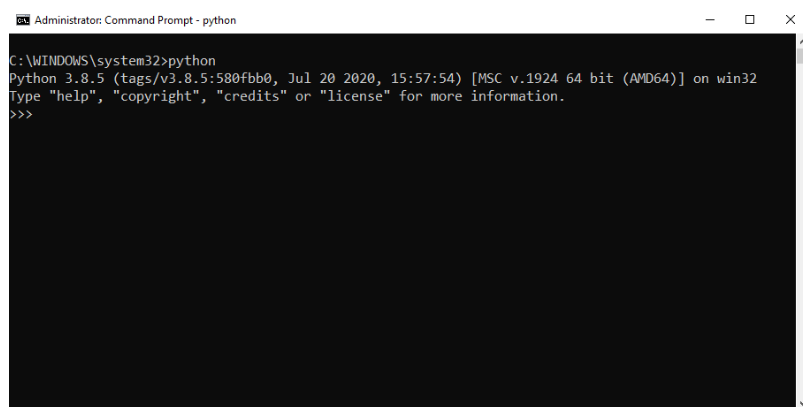

# Install Python on Windows
First, download the latest version of Python from the download page.

Second, double-click the installer file to launch the setup wizard.

In the setup window, you need to check the Add Python 3.8 to PATH and click Install Now to begin the installation.

It’ll take a few minutes to complete the setup.

Once the setup completes, you’ll see the following window:

## Verify the installation
To verify the installation, you open the Run window and type cmd and press Enter:

In the Command Prompt, type python command as follows:

If you see the output like the above screenshot, you’ve successfully installed Python on your computer.

To exit the program, you type `Ctrl-Z` and press `Enter`.

If you see the following output from the Command Prompt after typing the python command:

`'python' is not recognized as an internal or external command,
operable program or batch file.`

Likely, you didn’t check the Add Python 3.8 to PATH checkbox when you install Python.

