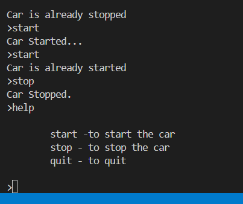

```python
command=""
while command.lower()!="quit":
    command=input(">")
    if command.lower()=="start":
      print("Car Started...")
    elif command.lower()=="stop":
       print("Car Stopped.")  

```       


in the above code we are repeatedly using lower() method.
but it is not good as per DRY principle
how to avoid so
```python
command=""
while command!="quit":
    command=input(">").lower()
    if command=="start":
      print("Car Started...")
    elif command=="stop":
       print("Car Stopped.") 
    elif command=="help":
       print("""
        start -to start the car
        stop - to stop the car
        quit - to quit     
        """)    
    else:
       print("Sorry, I don't understand that!")   
```


 here i have given the quit 
 but it shows sorry i can't understand that

so add below line of code above else part
```python
elif command=="quit":    
        break
```

```python
command=""
while command!="quit":
    command=input(">").lower()
    if command=="start":
      print("Car Started...")
    elif command=="stop":
       print("Car Stopped.") 
    elif command=="help":
       print("""
        start -to start the car
        stop - to stop the car
        quit - to quit     
        """)   
    elif command=="quit":    
        break
    else:
       print("Sorry, I don't understand that!")   
```
but here we checked quit 2 times one in while loop another one in elif. It is not a good approach

```python
command=""
while True:
    command=input(">").lower()
    if command=="start":
      print("Car Started...")
    elif command=="stop":
       print("Car Stopped.") 
    elif command=="help":
       print("""
        start -to start the car
        stop - to stop the car
        quit - to quit     
        """)   
    elif command=="quit":    
        break
    else:
       print("Sorry, I don't understand that!")  
```


whenever we give help output as below


so remove the indendation for help and run


Next challenge here whenever we give start again start car starts repeately
```python 
command=""
started=False
while True:
    command=input(">").lower()
    if command=="start":
        if started:
            print("Car is already started")
        else:
            started=True    
            print("Car Started...")
    elif command=="stop":
       if not started:
        print("Car is already stopped")
       else:
        started=False         
        print("Car Stopped.") 
    elif command=="help":
       print("""
 start -to start the car
 stop - to stop the car
 quit - to quit     
        """)   
    elif command=="quit":    
        break
    else:
       print("Sorry, I don't understand that!")   
 ```      

 