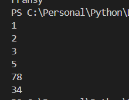

```python
for item in "Python":
    print
```


```python
for item in ["Geetha","Riya","Fransy"]:
    print(item)
```


```python
for item in [1,2,3,5,78,34]:
    print(item)
```


## range

```python
for item in range(10):
    print(item)

for item in range(10,15):
    print(item)   

for item in range(12,24,2):
    print(item)
```
 # calculate the total prices of all items in the cart   