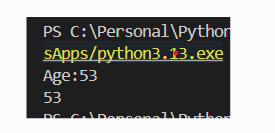
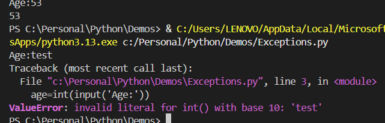
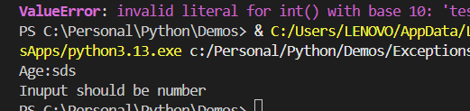

# how to handle errors
```python
age=int(input('Age:'))
print(age)
```



input =samsds


we got an error **valueError**

program excited code with 1


```python
# how to handle errors
try:
    age=int(input('Age:'))
    print(age)
except ValueError:
    print('Inuput should be number')

```



# Example for multiple exept block 
```python
try:
    age=int(input('Age:'))
    income=20000
    risk=income/age
    print(age)
except ValueError:
    print('Inuput should be number')
except ZeroDivisionError:
```

#  catch other general exception as error
```python
try:
    # get input net sales
    print('Enter the net sales for')

    previous = float(input('- Prior period:'))
    current = float(input('- Current period:'))

    # calculate the change in percentage
    change = (current - previous) * 100 / previous

    # show the result
    if change > 0:
        result = f'Sales increase {abs(change)}%'
    else:
        result = f'Sales decrease {abs(change)}%'

    print(result)
except ValueError:
    print('Error! Please enter a number for net sales.')
except ZeroDivisionError:
    print('Error! The prior net sales cannot be zero.')
except Exception as error:
    print(error)

```    

# Python try…except…finally
The try...except statement allows you to catch one or more exceptions in the try clause and handle each of them in the except clauses.

The try...except statement also has an optional clause called finally:

The finally clause always executes whether an exception occurs or not. And it executes after the try clause and any except clause.

```python
a = 10
b = 0

try:
    c = a / b
    print(c)
except ZeroDivisionError as error:
    print(error)
finally:
    print('Finishing up.')
```

## Python try…finally statement
The catch clause in the try...catch...finally statement is optional. So you can write it like this:
```python
try:
    # the code that may cause an exception
finally:
    # the code that always executes

```

Typically, you use this statement when you cannot handle the exception but you want to clean up resources. For example, you want to close the file that has been opened.

# Summary
Use Python try...catch...finally statement to execute a code block whether an exception occurs or not.

Use the finally clause to clean up the resources such as closing files.

# Python try…except…else
The try statement has an optional else clause with the following syntax:

```python
try:
    # code that may cause errors
except:
    # code that handle exceptions
else:
    # code that executes when no exception occurs
```
The `try...except...else` statement works as follows:

If an exception occurs in the `try` clause, Python skips the rest of the statements in the ``try`` clause and the `except` statement execute.

In case no exception occurs in the `try` clause, the else clause will execute.

When you include the `finally` clause, the `else` clause executes after the `try` clause and before the `finally` clause.

# Example to use the try...except...else

**First, define a function for calculating the (BMI) based on height and weight:**
```python
def calculate_bmi(height, weight):
    """ calculate body mass index (BMI) """
    return weight / height**2

```

**Second, define another function for evaluating BMI:**
```python
def evaluate_bmi(bmi):
    """ evaluate the bmi """
    if 18.5 <= bmi <= 24.9:
        return 'healthy'

    if bmi >= 25:
        return 'overweight'

    return 'underweight'
```

**Third, define a new `main()` function that prompts users for entering height and weight, and prints out the BMI result:**

```python
def main():
    try:
        height = float(input('Enter your height (meters):'))
        weight = float(input('Enter your weight (kilograms):'))

    except ValueError as error:
        print('Error! please enter a valid number.')
    else:
        bmi = round(calculate_bmi(height, weight), 1)
        evaluation = evaluate_bmi(bmi)

        print(f'Your body mass index is {bmi}')
        print(f'This is considered {evaluation}!')

main()
```

The` main()` function uses the `try...except...else` statement to control its flow. If you enter height and weight that cannot be converted to numbers, the `ValueError` exception will occur.

If no exception occurs, the `else` clause will execute. It calculates the BMI index and displays the evaluation.

## Whole code together
```python
def calculate_bmi(height, weight):
    """ calculate body mass index (BMI) """
    return weight / height**2


def evaluate_bmi(bmi):
    """ evaluate the bmi """
    if 18.5 <= bmi <= 24.9:
        return 'healthy'

    if bmi >= 25:
        return 'overweight'

    return 'underweight'


def main():
    try:
        height = float(input('Enter your height (meters):'))
        weight = float(input('Enter your weight (kilograms):'))

    except ValueError as error:
        print(error)
    else:
        bmi = round(calculate_bmi(height, weight), 1)
        evaluation = evaluate_bmi(bmi)

        print(f'Your body mass index is {bmi}')
        print(f'This is considered {evaluation}!')

main()
```

# Python try…except…else statement examples
```python
def main():
    try:
        height = float(input('Enter your height (meters):'))
        weight = float(input('Enter your weight (kilograms):'))

    except ValueError as error:
        print('Error! please enter a valid number.')
    else:
        bmi = round(calculate_bmi(height, weight), 1)
        evaluation = evaluate_bmi(bmi)

        print(f'Your body mass index is {bmi}')
        print(f'This is considered {evaluation}!')

```