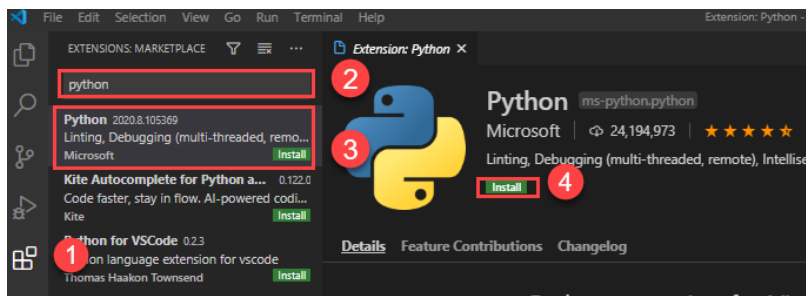

# Setup Visual Studio Code for Python

## Setting up Visual Studio Code
To set up the VS Code, you follow these steps:

First, navigate to the VS Code official website and download the VS code based on your platform (Windows, macOS, or Linux).

Second, launch the setup wizard and follow the steps.

Once the installation is completed, you can launch the VS code application:

# Install Python Extension
To make the VS Code work with Python, you need to install the Python extension from the Visual Studio Marketplace.

The following picture illustrates the steps:

First, click the Extensions tab.
Second, type the python keyword on the search input.
Third, click the Python extension. It’ll show detailed information on the right pane.
Finally, click the Install button to install the Python extension.