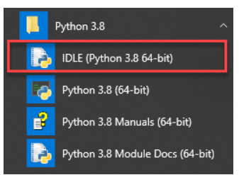
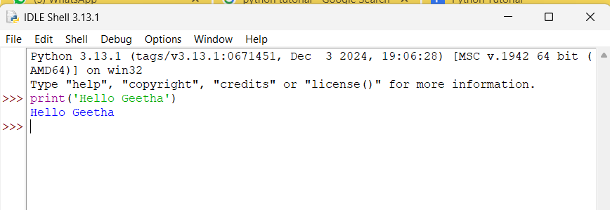

# Python Hello World

##Creating a new Python project
First, create a new directory called helloworld anywhere in your system e.g., C:\ drive.

Second, launch the VS code and open the helloworld directory.

Third, create a new app.py file, enter the following code, and save it:
```python
print('Hello, World!')
```
The print() is a built-in function that displays a message on the screen. In this example, it’ll show the message 'Hello, Word!'.

## What is a function
When you sum two numbers, that’s a function. And when you multiply two numbers, that’s also a function. In general, a function takes your inputs, applies some rules, and returns a result.

In the above example, the print() is a function. It accepts a string and shows it on the screen.

## Executing the Python Hello World program
To execute the app.py file, you first launch the Command Prompt on Windows or Terminal on macOS or Linux.

Then, navigate to the helloworld directory.

After that, type the following command to execute the app.py file:

`python app.py`

Hello, World!

If you use VS Code, you can also launch the Terminal within the VS code by:

Accessing the menu Terminal > New Terminal
Or using the keyboard shortcut Ctrl+Shift+`.
Typically, the backtick key (`) located under the Esc key on the keyboard.

# Python IDLE
Python IDLE is the Python Integration Development  Environment (IDE) that comes with the Python distribution by default.

The Python IDLE is also known as an interactive interpreter. It has many features such as:

Code editing with syntax highlighting
Smart indenting
And auto-completion
In short, the Python IDLE helps you experiment with Python quickly in a trial-and-error manner.

The following shows you step by step how to launch the Python IDLE and use it to execute the Python code:

First, launch the Python IDLE program:


A new Python Shell window will display as follows:


Now, you can enter the Python code after the cursor >>> and press Enter to execute it.

For example, you can type the code print('Hello, World!') and press Enter, you’ll see the message Hello, World! immediately on the screen:

Python Hello World - Executing code
# Summary
Use the python app.py command from the Command Prompt on Windows or Terminal on macOS or Linux to execute the app.py file.
Use the print() function to show a message on the screen.
Use the Python IDLE to type Python code and execute it immediately.