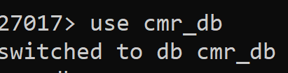

install mongodb shell

Extract

bin
 mongosh

Enter the port number :27017

create db 
`use cmr_db`



```sql
db.books.insertOne({
...     title: 'MongoDB insertOne',
...     isbn: '0-7617-6154-3'
... });
```
switch to yourdb

`use cmr_db`
already on db cmr_db

## to view the collection(table) in your db
`show collections`

## to view the document(record) from the table

 `db.books.find()`
 
[
  {
    _id: ObjectId('67a2ed60fd50c97636cb0ce2'),
    title: 'MongoDB insertOne',
    isbn: '0-7617-6154-3'
  }
]